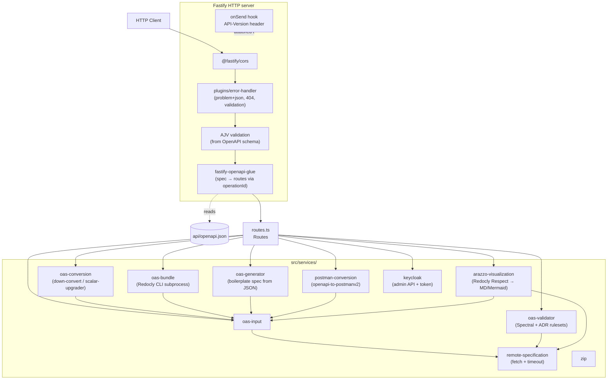
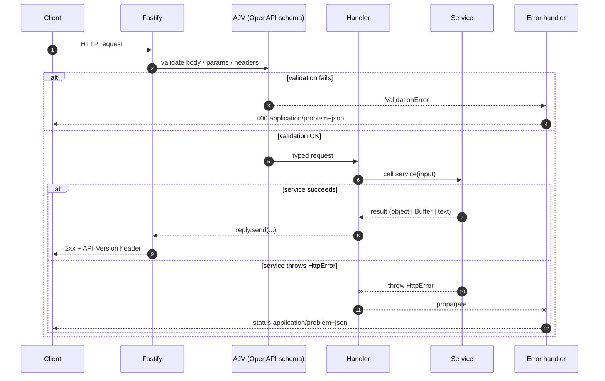

# Tools API

Modern Node.js / TypeScript implementation of the developer.overheid.nl Tools API.

## Stack

- **Runtime**: Node.js 22+ (native ESM, native `--env-file`, native `fetch`)
- **Package manager**: pnpm (via Corepack)
- **Language**: TypeScript (strict, `NodeNext`)
- **Framework**: [Fastify v5](https://fastify.dev/) + [`fastify-openapi-glue`](https://github.com/seriousme/fastify-openapi-glue)
- **Logger**: [pino](https://getpino.io/) (built into Fastify), `pino-pretty` for dev
- **Validation**: JSON Schema via Fastify/AJV, driven by the OpenAPI specification
- **Tests**: [Vitest](https://vitest.dev/)
- **Lint/format**: [Biome](https://biomejs.dev/)

## High-level technical design

### Principles

1. **OpenAPI is the single source of truth.** The spec in `api/openapi.json`
   defines routes, requests, responses, and validation. Code does not describe
   the spec — the spec drives the code.
2. **Operation-to-handler binding via `operationId`.** Routes are wired to
   handlers automatically at startup by `fastify-openapi-glue`. Adding an
   endpoint = one spec entry + one handler method with the same name.
3. **No per-route request/response glue.** Validation, content negotiation,
   header injection and error mapping live in central plugins and hooks.
   Handlers only contain domain logic.
4. **RFC 7807 for every error.** A single error handler translates business
   errors (`HttpError`) and Fastify validation errors into
   `application/problem+json`.
5. **Strict layer separation.** `routes.ts` is thin (HTTP ↔ services);
   `services/` contains all business logic and is HTTP-agnostic; `utils/` is
   generic. This keeps services independently testable (see
   `oas-conversion.test.ts`).
6. **Template-friendly.** The structure is intentionally regular so it can
   serve as the basis for an openapi-generator template later: a single
   `Routes` class with one method per `operationId`, plus one service per
   business capability in `services/`.

### Component overview



### Request flow



### Bootstrap & lifecycle

1. **Bootstrap** (`server.ts`): loads `.env`, builds the app, listens on
   `${HOST}:${PORT}`, hooks SIGTERM/SIGINT into `app.close()`.
2. **App factory** (`app.ts`): reads `api/openapi.json`, registers CORS, the
   error-handler plugin, the `onSend` hook (`API-Version`), and
   `fastify-openapi-glue`. Glue generates routes from the spec and binds them
   to `Routes` methods by `operationId` (case-normalised to lowerCamelCase).
3. **Validation**: AJV validates the request against the spec schema before the
   handler runs. On failure → 400 problem+json.
4. **Handler** (`routes.ts`): maps `request.body` onto the
   service input, invokes the service, and returns the result. For
   binary/text responses (`Buffer`, markdown, mermaid) the handler sets
   `Content-Type` and `Content-Disposition` itself.
5. **Service**: pure business logic. External input is fetched via `oas-input`
   (body) or `remote-specification` (URL). Failures are thrown as
   `HttpError(status, message, { detail, errors })`.
6. **Errors**: a thrown handler error or a validation failure lands in the
   error handler, which maps it to a `ProblemDetails` object and emits it as
   `application/problem+json`.

### Error handling (RFC 7807)

Every response with status ≥ 400 has this shape:

```json
{
  "type": "https://developer.mozilla.org/en-US/docs/Web/HTTP/Reference/Status/400",
  "title": "Bad Request",
  "status": 400,
  "detail": "body must have required property 'email'",
  "instance": "/v1/auth/clients",
  "errors": [
    { "detail": "must have required property 'email'", "pointer": "#/email" }
  ]
}
```

Services raise `HttpError` (`utils/problem-details.ts`); the error handler in
`plugins/error-handler.ts` is the only place that formats responses.

### Configuration

`src/config.ts` is the only place that touches `process.env`. Variables are
parsed once at module load and exported as a typed `const`. Dev uses
`--env-file=.env`; production expects external env injection (Docker,
Kubernetes), with `--env-file-if-exists=.env` as a fallback.

### Logging

Pino structured JSON in production; `pino-pretty` with timestamps in dev.
Fastify logs every request and response automatically. Services do not log
themselves — failures propagate as exceptions to the error handler, which
calls `request.log.error` with the root cause.

### Testability

- **Service tests** call services directly (no HTTP). Example:
  `test/oas-conversion.test.ts`.
- **App tests** use Fastify's `app.inject()` (no socket needed) so end-to-end
  routes — including validation and error mapping — are covered. Example:
  `test/app.test.ts`.

### Future openapi-generator template

The layout is deliberately regular so it can serve as a template:

| Spec element                | Generated artefact                                       |
| --------------------------- | -------------------------------------------------------- |
| Whole spec                  | `api/openapi.json`, `app.ts`, `server.ts`, `config.ts`   |
| All operations              | One `Routes` class in `src/routes.ts`                    |
| `operationId`               | One method on that class (lowerCamelCase-normalised)     |
| Tag                         | Used only for docs grouping; large APIs MAY split per tag |
| `components.schemas.<Name>` | Optional TS type via a separate step (`openapi-typescript`) |

One service stub in `src/services/` is created per tag. Existing service
implementations stay untouched (compare the old project's
`.openapi-generator-ignore`).

## Project layout

```
api/openapi.json          OpenAPI 3.x specification (single source of truth)
src/
  server.ts               Server bootstrap (graceful shutdown)
  app.ts                  Fastify app factory (loads spec, wires plugins)
  config.ts               Typed environment config
  routes.ts               OpenAPI-glue handler class (Routes)
  services/               Business logic (one file per service)
  plugins/                Fastify plugins (error handler, …)
  utils/                  Helpers (problem details, file names, …)
  types/                  Local `.d.ts` shims for untyped deps
test/                     Vitest tests (service + app.inject)
```

## Usage

```sh
cp .env.example .env
corepack enable          # one-time, enables pnpm shipped with Node
pnpm install
pnpm dev                 # tsx watch
pnpm build               # tsc → dist/
pnpm start               # production (node dist/server.js)
pnpm test
pnpm typecheck
pnpm lint                # biome
```

## OpenAPI

The spec lives at `api/openapi.json` and is also served at
`GET /v1/openapi.json`. Routes are wired automatically based on `operationId`;
every `operationId` maps to a method on `Routes` in `src/routes.ts`. Names are
normalised to lowerCamelCase before lookup, so `ConvertOAS`, `convert_oas` and
`convertOAS` all resolve to the same handler.
